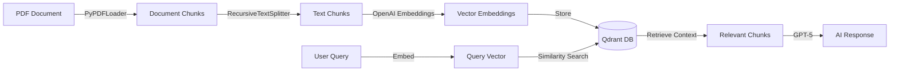

# 🤖 RAG PDF Q&A System

<div align="center">


**An intelligent RAG (Retrieval Augmented Generation) system that enables conversational querying of PDF documents using advanced vector search and GPT models.**

[Features](#-features) • [Tech Stack](#-tech-stack) • [Installation](#-installation) • [Usage](#-usage) • [Architecture](#-architecture)

</div>

---

## 📋 Overview

This project implements a production-ready **Retrieval Augmented Generation (RAG)** pipeline that allows users to chat with their PDF documents. The system intelligently retrieves relevant context from documents and provides accurate, source-cited responses using OpenAI's GPT models.

### 🎯 Key Highlights

- **Vector Search**: Leverages Qdrant for high-performance semantic search
- **Smart Chunking**: Recursive text splitting with configurable overlap for optimal context preservation
- **Source Attribution**: Every answer includes page numbers and source references
- **Scalable Architecture**: Docker-based deployment for easy scaling
- **Production-Ready**: Environment-based configuration and error handling

---

## ✨ Features

- 📄 **PDF Processing**: Automated extraction and indexing of PDF documents
- 🔍 **Semantic Search**: Advanced vector similarity search using OpenAI embeddings
- 💬 **Conversational AI**: Natural language Q&A powered by GPT-5
- 📍 **Source Tracking**: Precise page number references for every answer
- 🐳 **Dockerized**: Easy deployment with docker-compose
- ⚡ **Fast Retrieval**: Optimized vector database queries
- 🔒 **Secure**: Environment-based API key management

---

## 🛠 Tech Stack

<table>
<tr>
<td align="center" width="25%">

<br><strong>Python 3.8+</strong>
<br><sub>Core Language</sub>
</td>
<td align="center" width="25%">

<br><strong>OpenAI</strong>
<br><sub>GPT-5 & Embeddings</sub>
</td>
<td align="center" width="25%">

<br><strong>LangChain</strong>
<br><sub>Orchestration</sub>
</td>
<td align="center" width="25%">

<br><strong>Qdrant</strong>
<br><sub>Vector Database</sub>
</td>
</tr>
</table>

### Dependencies

```python
langchain-openai       # OpenAI integrations
langchain-qdrant       # Qdrant vector store
langchain-community    # Document loaders
python-dotenv          # Environment management
openai                 # OpenAI API client
pypdf                  # PDF processing
```

---

## 🚀 Installation

### Prerequisites

- Python 3.8 or higher
- Docker & Docker Compose
- OpenAI API Key

### 1. Clone the Repository

```bash
git clone https://github.com/yourusername/rag-pdf-qa.git
cd rag-pdf-qa
```

### 2. Set Up Environment

```bash
# Create virtual environment
python -m venv venv
source venv/bin/activate  # On Windows: venv\Scripts\activate

# Install dependencies
pip install -r requirements.txt
```

### 3. Configure Environment Variables

Create a `.env` file in the root directory:

```env
OPENAI_API_KEY=your_openai_api_key_here
QDRANT_URL=http://localhost:6333
```

### 4. Start Qdrant Vector Database

```bash
docker-compose up -d
```

This will start Qdrant on `http://localhost:6333`

---

## 📖 Usage

### Step 1: Index Your PDF Documents

Place your PDF file in the project directory and update the filename in `index.py`:

```python
pdf_path = Path(__file__).parent / "your_document.pdf"
```

Run the indexing script:

```bash
python index.py
```

**Expected Output:**
```
Indexing of documents done....
```

### Step 2: Query Your Documents

Start the chat interface:

```bash
python chat.py
```

**Example Interaction:**
```
Ask something: What are the key findings in chapter 3?
🤖: Based on the document, Chapter 3 discusses three key findings:
1. [Finding details...]
2. [Finding details...]

You can find more details on Page 42 of the document.
```

---

## 🏗 Architecture



### Component Breakdown

#### 1. **Document Processing** (`index.py`)
- Loads PDF using `PyPDFLoader`
- Splits text with 1000 char chunks (400 char overlap)
- Generates embeddings with `text-embedding-3-large`
- Stores in Qdrant vector database

#### 2. **Query System** (`chat.py`)
- Accepts user queries
- Performs semantic similarity search
- Constructs context-aware prompts
- Returns GPT-5 generated responses with citations

---

## 📁 Project Structure

```
rag-pdf-qa/
│
├── chat.py                 # Main query interface
├── index.py                # Document indexing script
├── docker-compose.yml      # Qdrant setup
├── .env                    # Environment variables
├── .gitignore             # Git ignore rules
├── requirements.txt        # Python dependencies
├── README.md              # Documentation
└── your_document.pdf      # Your PDF files
```

---

## ⚙️ Configuration

### Chunking Parameters

Adjust in `index.py`:

```python
text_splitter = RecursiveCharacterTextSplitter(
    chunk_size=1000,        # Characters per chunk
    chunk_overlap=400       # Overlap between chunks
)
```

### Embedding Model

Change in both files:

```python
embedding_model = OpenAIEmbeddings(
    model="text-embedding-3-large"  # or "text-embedding-3-small"
)
```

### GPT Model

Update in `chat.py`:

```python
response = openai_client.chat.completions.create(
    model="gpt-5",  # or "gpt-4", "gpt-3.5-turbo"
    ...
)
```

---

## 🔍 How It Works

1. **Indexing Phase**:
   - PDF is loaded and split into manageable chunks
   - Each chunk is converted to a vector embedding
   - Embeddings are stored in Qdrant with metadata (page number, source)

2. **Query Phase**:
   - User query is converted to a vector
   - Similar document chunks are retrieved
   - Context + query sent to GPT-5
   - AI generates answer with page references

---

## 🤝 Contributing

Contributions are welcome! Here's how you can help:

1. Fork the repository
2. Create a feature branch (`git checkout -b feature/AmazingFeature`)
3. Commit your changes (`git commit -m 'Add some AmazingFeature'`)
4. Push to the branch (`git push origin feature/AmazingFeature`)
5. Open a Pull Request

---

## 📝 License

This project is licensed under the MIT License - see the [LICENSE](LICENSE) file for details.

---

## 🙏 Acknowledgments

- [LangChain](https://langchain.com/) for the amazing RAG framework
- [Qdrant](https://qdrant.tech/) for the vector database
- [OpenAI](https://openai.com/) for GPT and embedding models

---

<div align="center">

**If you found this helpful, please give it a ⭐️!**


</div>
